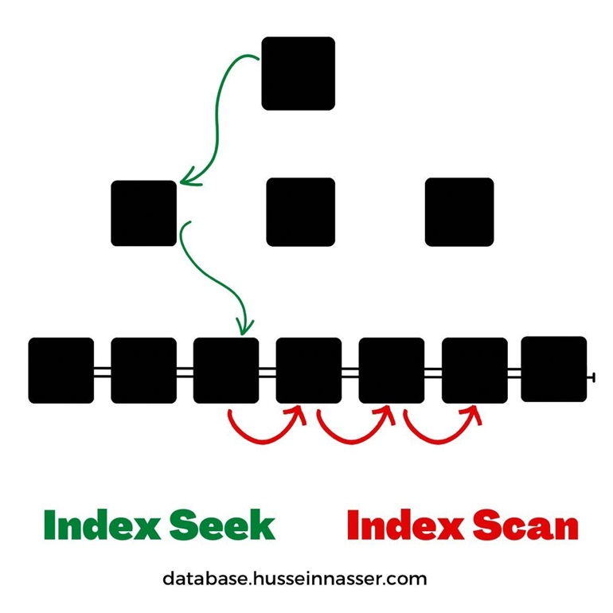

z# SQL-Playground

Learning SQL tips and sharing knowledge. 

## Window Functions 

- Window functions perform aggregate operations on groups of rows. But they **produce a result FOR EACH ROW**.
- `OVER()`, clause constructs a window. When it's empty, the window will include all records, e.g:

    ```SQL
    SELECT Id,
        department,
        salary,
        AVG(salary) OVER (PARTITION BY department) AS dept_avg
    FROM [dbo].[Employees];
    ```

    - in this example, we calculate the average salary for each department. 

- We can use aggregate functions(`MIN`, `MAX`, `AVG`) to calculate some numbers or signle value based on grouping, but information will be displayed with each individual row.
- `RANK`, window function works with `OVER` to allow us to find the rank of current row within its partition.
    ```SQL
    SELECT Id,
        department,
        salary,
        AVG(salary) OVER (PARTITION BY department) AS dept_avg,
        RANK() OVER(ORDER BY salary DESC) AS overall_rank
    FROM [dbo].[Employees];
    ```

    - in this example, we calculate the rank of each salary within a department and also the rank of each salary overall at the company, we used the `OVER (ORDER BY salary DESC)` inside of the OVER() clause to re-order rows within each window. 

- `ROW_NUMBER`, window function is used to assign a unique integer value to each row within a partition of a result set. It is often used in conjunction with the `OVER` clause to define the window or partition.
    ```SQL
    SELECT
        ROW_NUMBER() OVER (PARTITION BY column1 ORDER BY column2) AS row_num,
        column1,
        column2
    FROM table_name;
    ```
    - in this example, `ROW_NUMBER()` assigns a unique row number for each row within each partition defined by column1, ordered by column2. 

## SQL server execution plan

As a developer you need to be aware about the context of the queries you are dealing with, for queries you already have a knowledge about how they should be running or how they should be interacting with data you can start reading execution plans and find performance bottlenecks. 

If you are a new developer and you don't know about the queries you are dealing with and you need to investigate its performance, you can start by looking to **execution plans in cache** first before re-executing any queries. 

### How to read the execution plan? 

Execution plans shows you the steps that SQL Server uses to execute your query. 

- you can read execution plans right to left, top to bottom.
- by following the arrows of the plan right to left you are following the flow of data in the plan.
- the arrows in the actual execution plan represents the size of rows read by the operator to the right to the arrow.
- the **size** of an arrow indicate the relative size of data.
  - for troubleshooting, these arrows can help you to where you maybe are receiving more data than you expect.
- when hover over an operator, you'll see the description (_`F4` for properties_) of what the operator is doing, you can focus for example on:
  - the number of rows expected to read during the step.
  - the number of actual rows read.
- the cost percentage underneath each operator helps to identify where the least efficient part of your plan where you can focus your attention when troubleshooting performance.
- you can learn from operator's yellow exclamation point to indicate that there is a warning happening on that operator.
- use live query statistics to have a real time information about what's happening in your query.
  - when watching each operator complete from right to left and if an operator is taking a very long time to complete it helps you to identify query bottleneck. 

### What is an index? 

An index is a data structure that provides a fast and efficient way to look up records in a database table based on the values in one or more columns. 

### Clustered and Non-Clustered Indexes
- A clustered index defines the order in which data is physically stored in a table. For example Dictionary.
  - a table can have only one clustered index However, the index can contain multiple columns (a composite index).

- A non-clustered index is stored at one place and table data is stored in another place. For example Book Index.
  - the data is stored in one place, the index in another place. The index will have pointers to the storage location of the data.
  - since, the non-clustered index is stored separately from the actual data, a table can have more than one non-clustered index. 

- Clustered index is faster than a non clustered index  because, the non-clustered index has to refer back to the table, if the selected column is not present in the
index.

- Clustered index determines the storage order of rows in the table, and hence **doesn't require additional disk space**, but where as a Non-Clustered index is
stored separately from the table, additional storage space is required.

### Index seek vs Index scan

`Scan` operations read the entire index or table while `Seek` operations use the B-tree or a physical address to access a specific part of the index or table. 

- Index Scan pass through every row in the table it is qualified or not, the cost is proportional to the total number of rows in the table. Thus, a scan is an efficient strategy if the table is small or most of the rows qualify for the predicate. 

- Index seek means it retrieves selective rows from the table.

- SQL Server automatically chooses Index seek instead of Index Scan if we are querying a table with large number of records with selected rows in the result set. 

